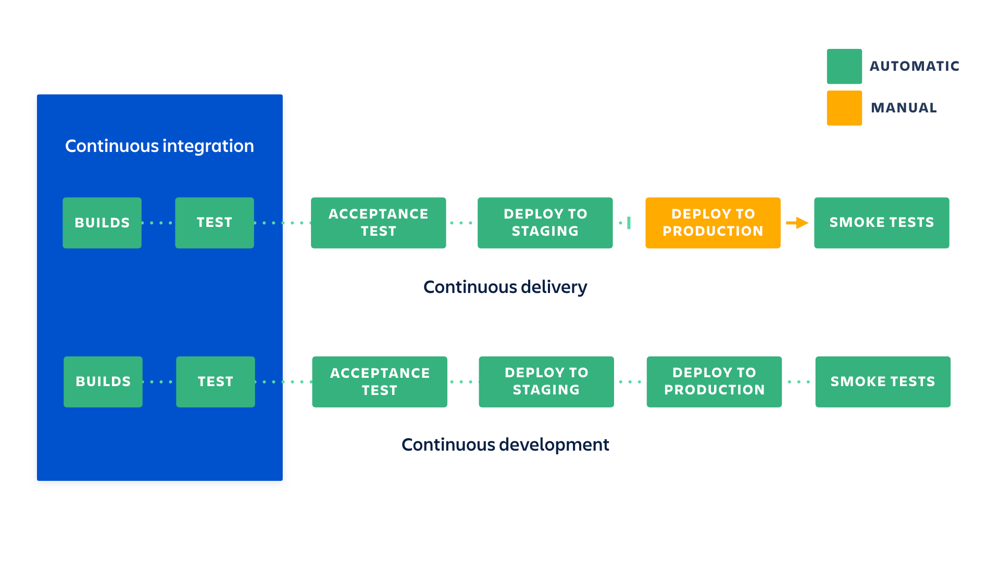

# CI/CD - Presentation
This presentation has been prepared to bring the CI / CD process concept closer, showing its advantages and use-cases. The presentation consists of:
 - the theoretical part - this presentation (article below is my cheatsheet for this presentation)
 - the practical part - Jenkins pipeline configuration using Jenkinsfile

### Presentation content:
1. CI / CD - explanation of the term.
2. CI / CD - what the process looks like.
3. CI / CD - advantages and disadvantages.
4. Good practices - do's and don'ts.
5. Jenkinsfile - what is it for?.
6. Technical part based on real world example.

### How to view presentation:
- Clone repository.
- Open `index.html` in the browser.

## Introduction
The most common source of errors in the work environment is man,
especially if their work is repeatable. Therefore, every task a machine can do should be. It helps to significantly reduce the number of errors and frees human resources.

### What is Continuous Integration?


The main point of continuous integration is to detect errors as early as possible in build process.

Continuous integration puts a great emphasis on testing automation to check that the application is not broken whenever new commits are integrated into the main branch.

### What is Continuous Delivery?


Continuous delivery is an extension of continuous integration. Continuous Delivery ensures that the code is ready and can be delivered at any time. **Requires CI!**

### What is Continuous Deployment?
Continuous deployment is very similar to Continuous delivery. The only difference is that continuous delivery require manual deployment (or more specificly approval).

The main purpose of CD is to release automatically every good build to the users.



### Benefits from implementing CI/CD process in projects

#### Continuous Integration:
1. Detecting bug in early stage - the earlier bug is detected, the less harm it makes
2. Reduces bug count.
3. The development process becomes more transparent - teams is notifed when build fails and what caused it.
4. Efficient - since whole process is automated, manual testing is reduced.

#### Continuous Delivery & Deployment:
1. Reduce the risk - deployment process may get complicated. It can consist of many steps. The more complicated the process, the greater the probability of human error. By automating this process we can assure, that every deployment will look similar.
2. Painless deployment, happier team.
3. Reduces costs.
4. A fully automated and transparent process.
5. Releases may happend more frequently.

### Cost of implementing CI/CD
CI / CD is an investment and as each investment has its own costs that are worth knowing before implementing this process.

#### Continuous Integration costs:
- Team needs to write automated tests.
- Server for automated tests.
- Developers need to merge their changes as often as possible.

#### Continuous Delivery & Deployment - Costs
- Strong foundations in CI process.
- Testing culture must be at its best. CD process require the highest quality of tests.
- Documentation needs to be updated frequently to keep up after deployments.
- The whole process requires knowledge and requires an experience, otherwise it can cause more problems than benefits.

## How does CI/CD process looks in practice?


Diagram of how CI/CD process may look like:

```
code > commit changes > build > unit test > deploy to staging machine > auto tests > deploy to production
```

## How to start
At the moment there is a lot of solutions for CI/CD on the market. The most popular ones are:
- Travis CI
- Circle CI
- Jenkins
- TeamCity
- Gitlab CI
- Codeship
- Bamboo

The simplest ones in integration are travis and circleci. They offer integration with many services such as slack, email and more out of the box. The big advantage is that you do not have to configure your own servers. These services are widely used for developing medium and small software, and such services are recommended for such software.

However, if more advanced solutions are needed, it is worth consider using solutions hosted on own servers such as free, open-source Jenkins. It allows for more custom solutions but requires knowledge and more time.

### Additional software used in CI/CD process:
- Docker
- Kubernates
- PM2
- Virtual machines
- All sorts of communication apps

## Sources
- https://jenkins.io/doc/book/pipeline/jenkinsfile/
- https://martinfowler.com/articles/continuousIntegration.html
- https://www.thoughtworks.com/continuous-integration
- https://css-tricks.com/continuous-integration-continuous-deployment/
- https://hackernoon.com/i-have-a-confession-to-make-i-commit-to-master-6a804f334beb
- https://medium.com/@dpaunin/the-best-architecture-with-docker-and-kubernetes-myth-or-reality-77b4f8f3804d
- https://atlassian.com/continuous-delivery/principles/continuous-integration-vs-delivery-vs-deployment
- https://medium.com/@nirespire/what-is-cicd-concepts-in-continuous-integration-and-deployment-4fe3f6625007
- https://medium.com/dailyjs/why-you-should-always-use-a-linter-and-or-pretty-formatter-bb5471115a76
- https://en.wikipedia.org/wiki/Apache_Groovy

The presentation was created using [reveal.js](https://github.com/hakimel/reveal.js/)
